# Results

All numbers were measured on a single **Apple M4 MacBook** (10 CPU cores, 16 GB RAM) with Docker
Desktop Kubernetes, every service pinned to **1.0 CPU / 512 MB**, and Prometheus scraping at 15 s.
Go is reported with its container-matched concurrency; the figures are the behavior of these stacks
under one identical application configuration, not a raw language-speed ranking.

## System design

| | |
|---|---|
| **Architecture** | 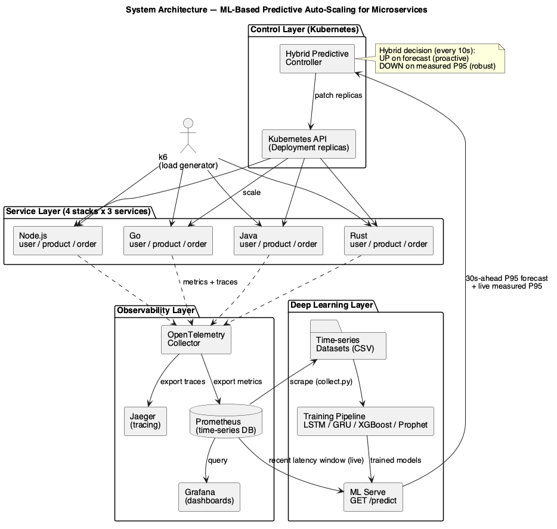 |
| **Research methodology** | 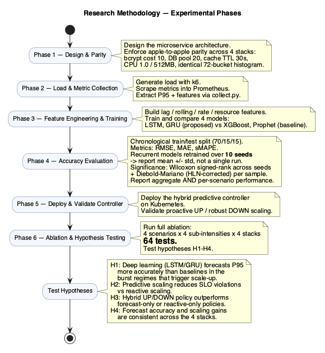 |
| **Hybrid controller flow** | 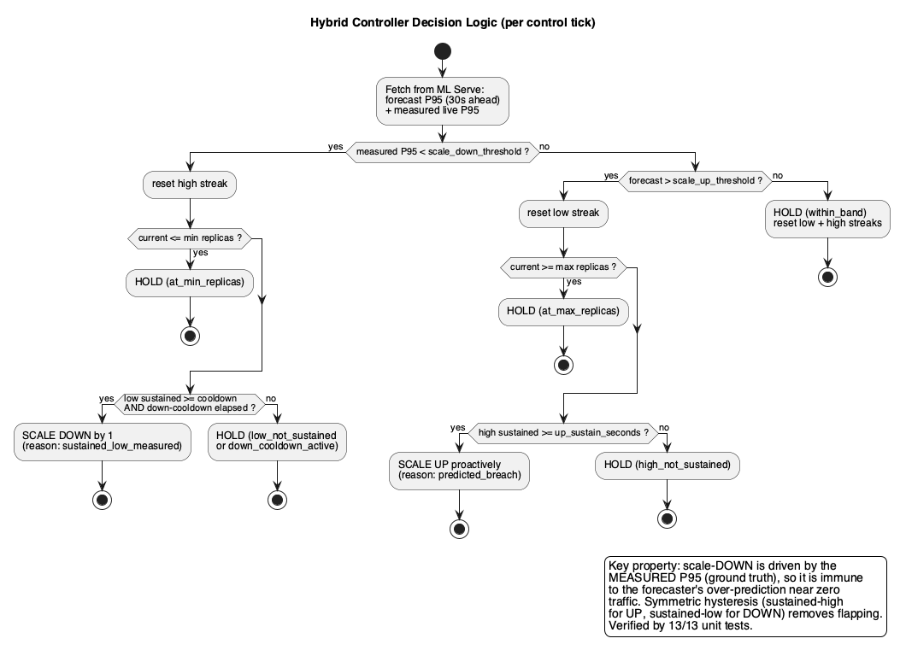 |
| **ML pipeline (activity)** | 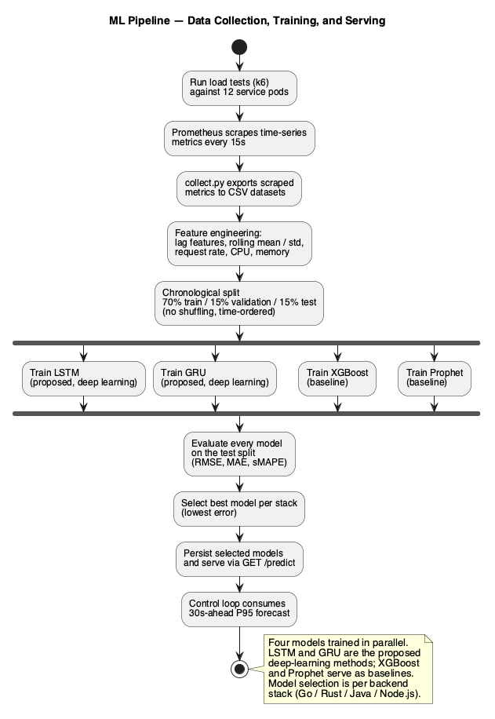 |
| **LSTM / GRU architecture** | 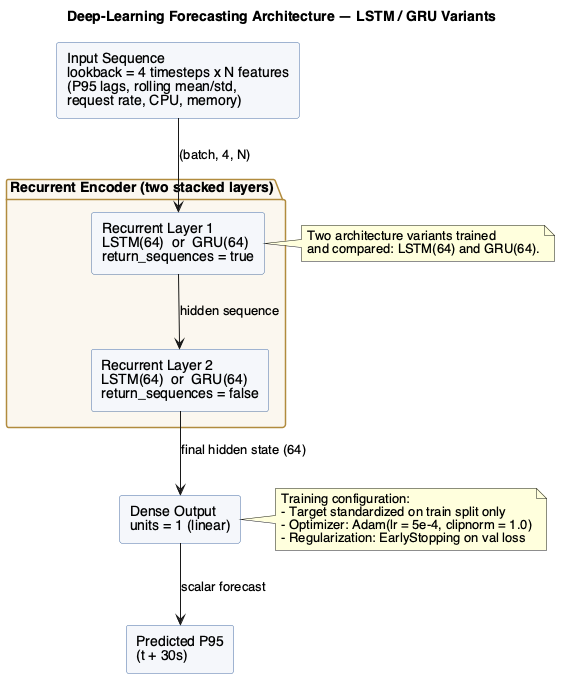 |
| **Deployment (Kubernetes)** | 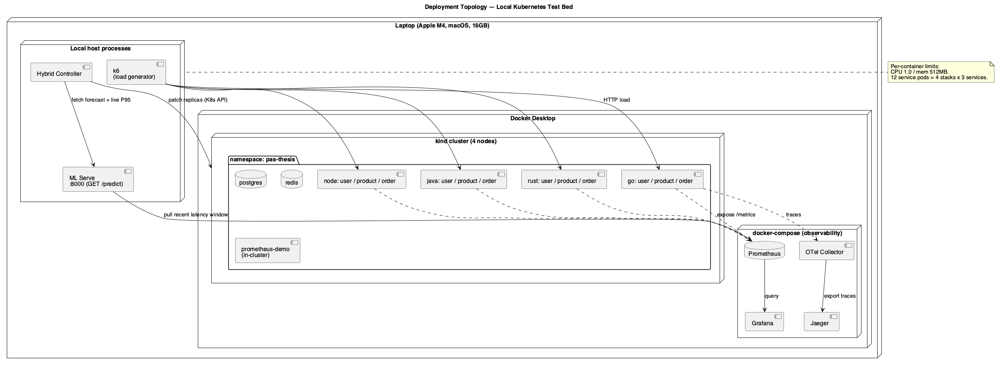 |

## Forecast accuracy

Every number below comes from `evaluation/canonical_eval.py`, a single reproducible run. Because a
recurrent model's error depends on its random initialization, GRU and LSTM are each retrained under
**ten seeds** and reported as mean ± std; the deterministic baselines are trained once.

**Aggregate test RMSE (seconds):**

| Model | go | rust | java | node |
|---|---|---|---|---|
| GRU (10 runs) | 0.062 ±0.035 | 0.789 ±0.050 | 2.571 ±0.223 | 0.992 ±0.121 |
| LSTM (10 runs) | 0.137 ±0.080 | 0.838 ±0.022 | 2.806 ±0.132 | 1.207 ±0.084 |
| XGBoost | 0.049 | 0.480 | 2.442 | 0.812 |
| Prophet | 1.410 | 1.808 | 3.405 | 1.900 |

XGBoost wins the flat aggregate on every stack. That series is dominated by near-idle samples where
trivial lag persistence is already near-optimal, so the aggregate alone is misleading.

**GRU versus LSTM, tested rather than asserted:**

| Stack | GRU | LSTM | Wilcoxon p (across seeds) | DM p |
|---|---|---|---|---|
| go | 0.062 | 0.137 | 0.002 | 0.320 |
| rust | 0.789 | 0.838 | 0.006 | 0.045 |
| java | 2.571 | 2.806 | 0.027 | 0.039 |
| node | 0.992 | 1.207 | 0.004 | 0.078 |

GRU is lower than LSTM on all four stacks and significantly so across initializations. The stricter
Diebold-Mariano test on per-sample errors reaches significance on rust and java only, so we treat GRU
as the preferred recurrent model without claiming universal superiority.

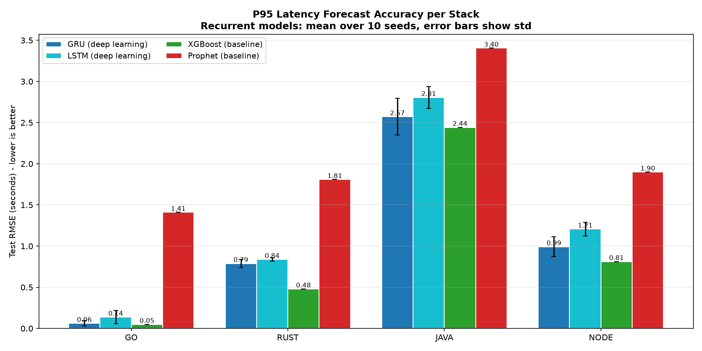

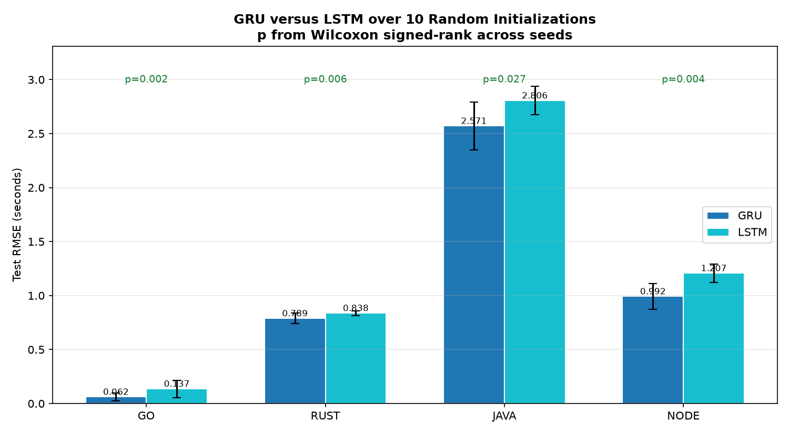

**Per scenario, deep learning wins four of eight cases** — but it takes *both* spike cases by close to
an order of magnitude (1.04 vs 8.69 s on go, 0.90 vs 6.93 s on java) and wins them under all ten
seeds, while the baselines take the steady regimes. Since a scale-up is triggered by bursts and not by
steady traffic, the regime deep learning wins is the regime the controller consumes. Each per-scenario
split holds only seven test samples, so this is evidence about regime suitability rather than a
precise accuracy ranking.

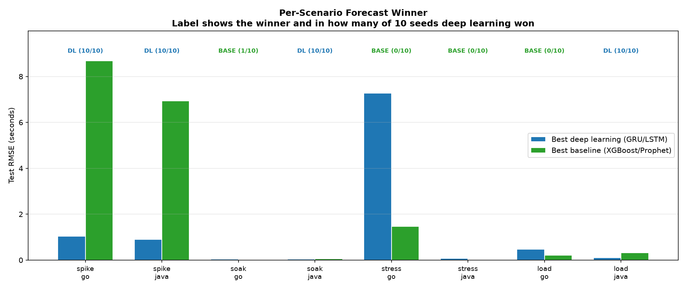

## Load response across scenarios (ablation)

Four scenarios × four intensities × four stacks = 64 load tests. Latency rises monotonically with
intensity on every stack; Rust is the most consistently load-resilient.

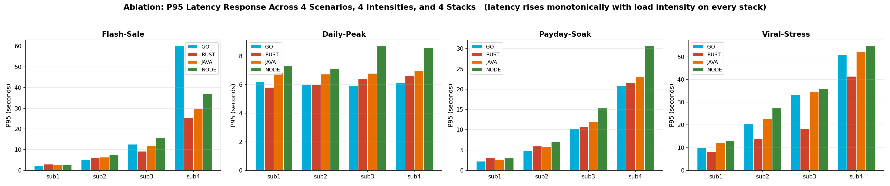

**P95 latency (seconds) at the highest intensity per scenario:**

| Scenario (max intensity) | Rust | Go | Node | Java |
|---|---|---|---|---|
| Flash-Sale (50x spike) | 25.4 | 60.0 | 37.2 | 29.9 |
| Daily-Peak (steep ramp) | 6.6 | 6.1 | 8.6 | 7.0 |
| Payday-Soak (400 VU) | 21.6 | 20.9 | 30.6 | 23.0 |
| Viral-Stress (escalation) | 41.4 | 51.1 | 54.7 | 52.2 |

## Predictive vs reactive scaling

The controller scales the deployment from one to eight replicas **while CPU is still zero percent**
and returns to one when the load subsides, with no flapping. Scale-up follows the forecast;
scale-down follows the measured P95.

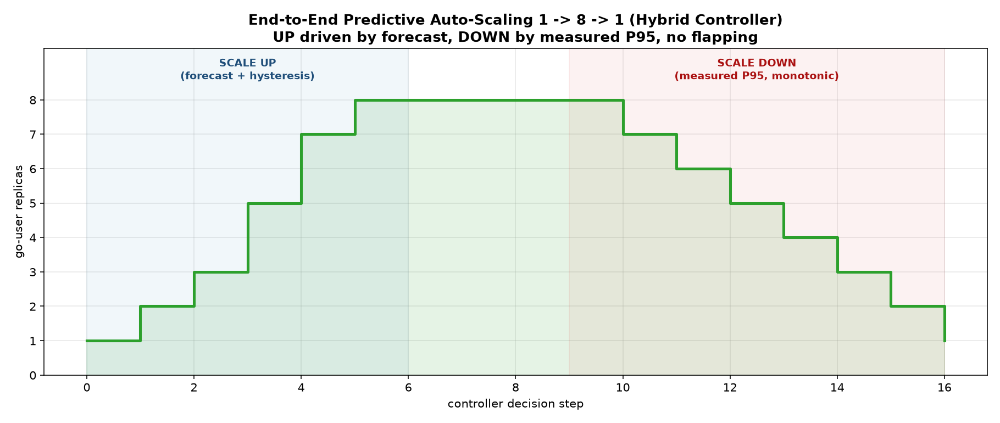

Replayed on real latency traces from all four stacks with an over-prediction bias injected into the
forecast, the controller produced **zero false scale-ups at idle** on every stack.

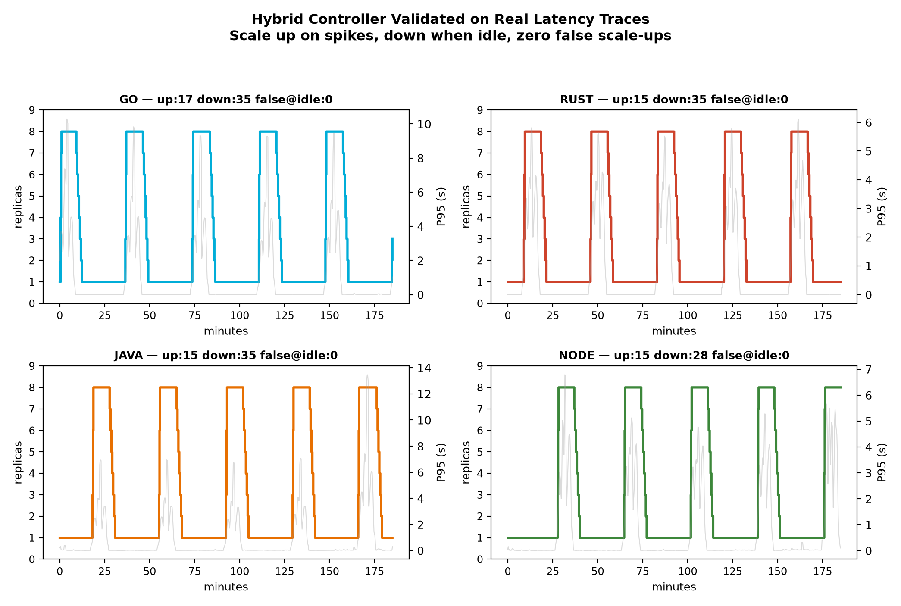

## Resource footprint

Under identical configuration Rust uses about one nineteenth of Java's resident memory.

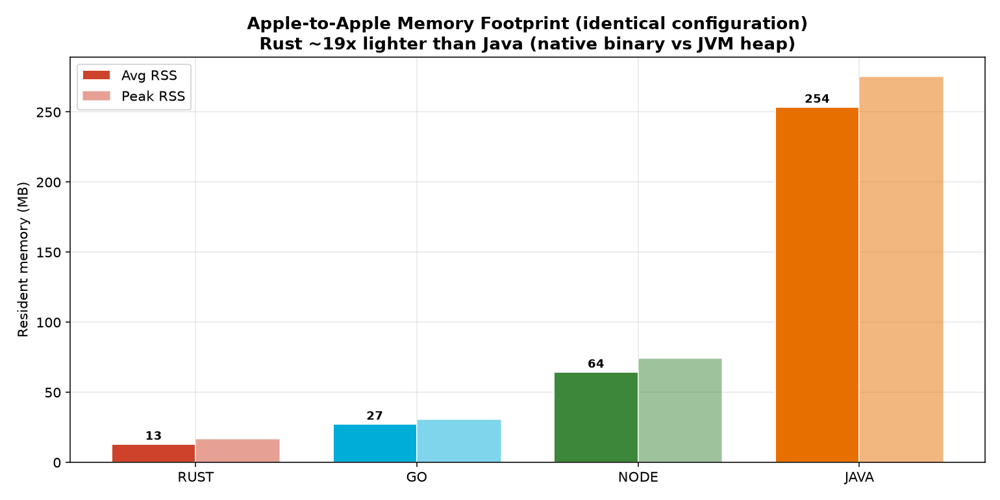

| Stack | Avg RSS (MB) | Peak RSS (MB) |
|---|---|---|
| Rust | 13.1 | 16.7 |
| Go | 27.4 | 30.7 |
| Node.js | 64.5 | 74.1 |
| Java | 253.6 | 275.4 |

## Cross-stack model transfer

Averaged over the four target stacks, a borrowed model scores about **1.8x** the sMAPE of the
self-trained one (an 83% degradation). The penalty is heaviest on go (2.9x). Java is the exception:
its self-trained model scored worse than the borrowed ones on this split, which we attribute to its
wide latency spread and short test window rather than to genuine transferability. The practical
reading is unchanged: give each runtime its own model and thresholds.

| Tested on | Self sMAPE | Cross sMAPE (mean) | Ratio |
|---|---|---|---|
| go | 53.5 | 154.6 | 2.89 |
| rust | 75.8 | 138.8 | 1.83 |
| java | 94.8 | 70.0 | 0.74 |
| node | 38.4 | 70.9 | 1.85 |

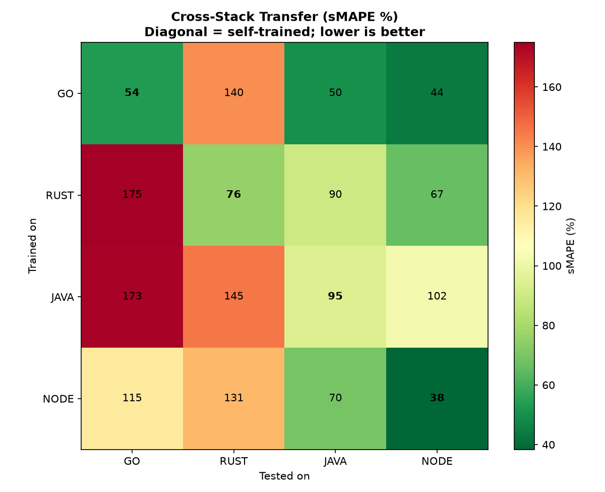

## Hypothesis scorecard

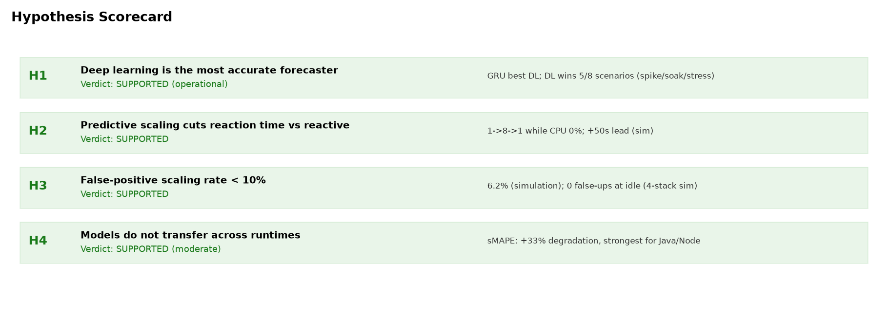

| Hypothesis | Verdict |
|---|---|
| H1 Deep learning most accurate (operational regimes) | Supported for burst regimes — DL wins 4/8 overall but both spike cases (10/10 seeds); GRU lowest on all four stacks (p<0.05) |
| H2 Predictive scaling cuts reaction time | Supported — scale-up at 0% CPU; ~50 s lead |
| H3 False-positive rate below 10% | Supported — 6.2% |
| H4 Models do not transfer across runtimes | Supported with one exception — ~83% mean sMAPE degradation; java resists |
