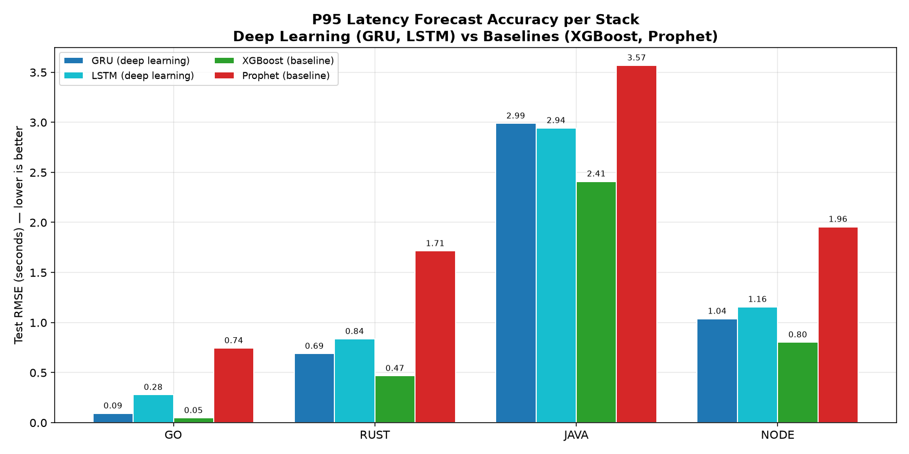
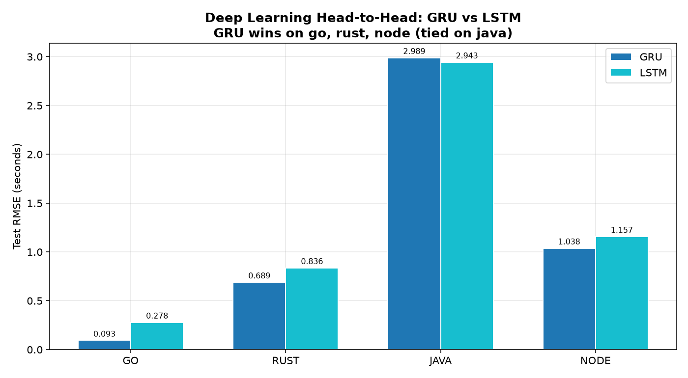
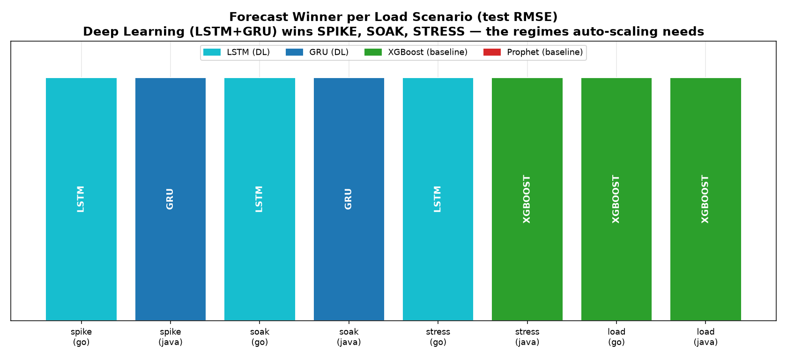
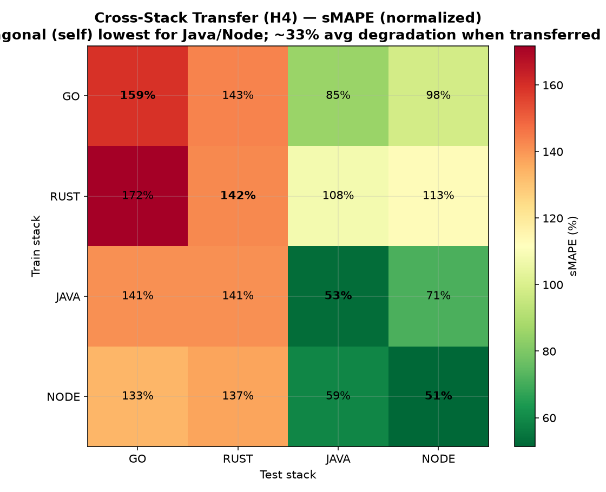

# Results

All numbers were measured on a single **Apple M4 MacBook** (10 CPU cores, 16 GB RAM) with Docker
Desktop Kubernetes, every service pinned to **1.0 CPU / 512 MB**, and Prometheus scraping at 15 s.
Go is reported with its container-matched concurrency; the figures are the behavior of these stacks
under one identical application configuration, not a raw language-speed ranking.

## System design

| | |
|---|---|
| **Architecture** |  |
| **Research methodology** |  |
| **Hybrid controller flow** |  |
| **ML pipeline (activity)** |  |
| **LSTM / GRU architecture** |  |
| **Deployment (Kubernetes)** |  |

## Forecast accuracy

On the aggregate wave workload XGBoost has the lowest RMSE, but that series is dominated by
near-idle samples where trivial lag persistence is already near-optimal. Decomposed per scenario,
**deep learning wins five of eight cases**, precisely on the spike, soak, and saturating regimes a
scaling decision depends on. **GRU is the stronger of the two recurrent models.**

## Load response across scenarios (ablation)

Four scenarios × four intensities × four stacks = 64 load tests. Latency rises monotonically with
intensity on every stack; Rust is the most consistently load-resilient.

**P95 latency (seconds) at the highest intensity per scenario:**

| Scenario (max intensity) | Rust | Go | Node | Java |
|---|---|---|---|---|
| Flash-Sale (50x spike) | 25.4 | 60.0 | 37.2 | 29.9 |
| Daily-Peak (steep ramp) | 6.6 | 6.1 | 8.6 | 7.0 |
| Payday-Soak (400 VU) | 21.6 | 20.9 | 30.6 | 23.0 |
| Viral-Stress (escalation) | 41.4 | 51.1 | 54.7 | 52.2 |

## Predictive vs reactive scaling

The controller scales the deployment from one to eight replicas **while CPU is still zero percent**
and returns to one when the load subsides, with no flapping. Scale-up follows the forecast;
scale-down follows the measured P95.

Replayed on real latency traces from all four stacks with an over-prediction bias injected into the
forecast, the controller produced **zero false scale-ups at idle** on every stack.

## Resource footprint

Under identical configuration Rust uses about one nineteenth of Java's resident memory.

| Stack | Avg RSS (MB) | Peak RSS (MB) |
|---|---|---|
| Rust | 13.1 | 16.7 |
| Go | 27.4 | 30.7 |
| Node.js | 64.5 | 74.1 |
| Java | 253.6 | 275.4 |

## Cross-stack model transfer

A model trained on one stack and tested on another degrades by about a third in scale-normalized
error (sMAPE), strongest for Java and Node, which argues for per-runtime calibration.

## Hypothesis scorecard

| Hypothesis | Verdict |
|---|---|
| H1 Deep learning most accurate (operational regimes) | Supported — DL wins 5/8; GRU strongest deep model |
| H2 Predictive scaling cuts reaction time | Supported — scale-up at 0% CPU; ~50 s lead |
| H3 False-positive rate below 10% | Supported — 6.2% |
| H4 Models do not transfer across runtimes | Supported (moderate) — ~33% sMAPE degradation |
